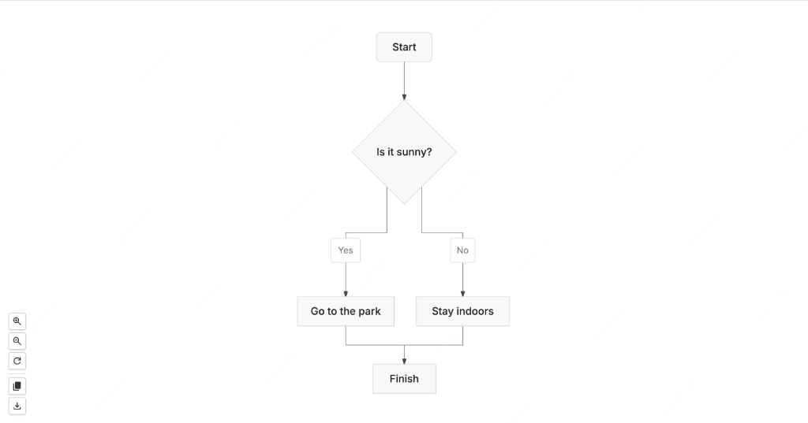
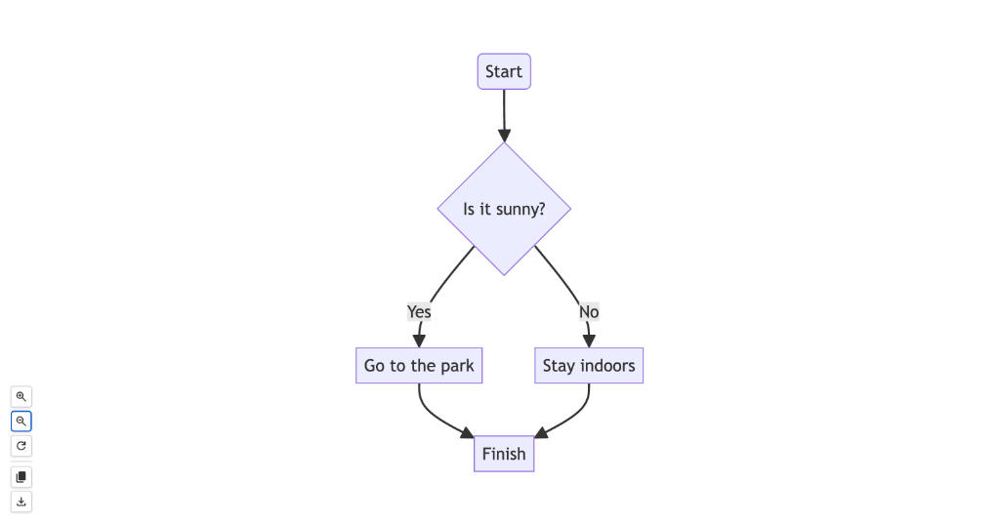

# mermaid.nvim 🧜

A feature-rich Neovim plugin for working with [Mermaid](https://mermaid.js.org/) diagrams.


## ✨ Features

- **Syntax Highlighting**: Relies on [nvim-treesitter](https://github.com/nvim-treesitter/nvim-treesitter) (official support).
- **Live Preview**:
  - **Multiple Renderers**: Choose between standard `mermaid.js` and the aesthetic-focused `beautiful-mermaid`.
  - **Real-time**: Diagram updates instantly as you type.
  - **Interactive**: Pan and Zoom support (with `svg-pan-zoom`).
  - **Toolbar**: Custom controls for Zoom, Reset, **Copy Image (PNG)**, and Downloading SVG.
  - **Zero-config**: Built-in Lua HTTP server (no external node/python server needed).
- **Auto-Formatting**:
  - Built-in indentation engine (no `prettier` dependency required).
  - Smart handling of blocks, diagrams, and directives.
- **Diagnostics**:
  - Integration with `vim.diagnostic` to show syntax errors (requires `mermaid-cli`).

## ⚡ Requirements

- **Neovim** >= 0.8.0
- **nvim-treesitter**: For syntax highlighting.
- **mermaid-cli** (Optional): Only needed for diagnostics (error checking).
  - `npm install -g @mermaid-js/mermaid-cli`

## 📦 Installation

Using [lazy.nvim](https://github.com/folke/lazy.nvim):

```lua
return {
    "kevalin/mermaid.nvim",
    dependencies = { "nvim-treesitter/nvim-treesitter" },
    config = function()
        require("mermaid").setup()

        -- Install the tree-sitter parser manually if TSInstall fails
        -- :TSInstall mermaid
    end,
}
```

## ⚙️ Configuration

The default configuration works out of the box. You can customize standard options:

```lua
require('mermaid').setup({
    format = {
        shift_width = 4, -- Indentation size
    },
    lint = {
        enabled = true,  -- Enable usage of mmdc for checking errors
        command = "mmdc", -- Path to mermaid-cli executable
    },
    preview = {
        renderer = "mermaid.js", -- "mermaid.js" (default) or "beautiful-mermaid"
        theme = "default",       -- Theme name (renderer-specific)
    }
})
```

## 🎨 Renderers

| Renderer | Description |
| :--- | :--- |
| `mermaid.js` | Official Mermaid.js renderer. Most reliable, supports all standard syntax including icons and edge labels. |
| `beautiful-mermaid` | Lightweight, aesthetic-focused renderer. Uses [beautiful-mermaid](https://github.com/lukilabs/beautiful-mermaid) for premium-styled SVGs. |

### Renderer Comparison

#### beautiful-mermaid (Modern/Premium)
Designed for high-quality, modern-looking diagrams.


> [!NOTE]
> `beautiful-mermaid` uses a simplified parser. For complex diagrams involving **Font Awesome icons** or **edge labels** (e.g., `A --> |label| B`), please use the official `mermaid.js` renderer.

#### mermaid.js (Standard/Full-featured)
Supports the full Mermaid specification.


### Supported Themes (beautiful-mermaid)
- `zinc-light` (default), `zinc-dark`
- `tokyo-night`, `tokyo-night-storm`, `tokyo-night-light`
- `catppuccin-mocha`, `catppuccin-latte`
- `nord`, `nord-light`
- `dracula`
- `github-light`, `github-dark`
- `solarized-light`, `solarized-dark`
- `one-dark`

## 🚀 Usage

### Commands

| Command           | Description                                                       |
| :---------------- | :---------------------------------------------------------------- |
| `:MermaidPreview` | Open a Live Preview in your browser (localhost). Updates on edit. |
| `:MermaidFormat`  | Auto-format the current buffer (indentation).                     |

### Keybindings

You can set up your own keybindings in your `init.lua` or `ftplugin/mermaid.lua`:

```lua
vim.api.nvim_create_autocmd("FileType", {
    pattern = "mermaid",
    callback = function()
        local buf = vim.api.nvim_get_current_buf()
        vim.keymap.set("n", "<leader>mp", "<cmd>MermaidPreview<CR>", { buffer = buf, desc = "Mermaid Preview" })
        vim.keymap.set("n", "<leader>mf", "<cmd>MermaidFormat<CR>", { buffer = buf, desc = "Mermaid Format" })
    end,
})
```

## 🛠️ Tree-sitter Setup

If you don't see syntax highlighting, ensure the parser is installed:

```vim
:TSInstall mermaid
```

## 📸 Preview Features

The live preview window includes a floating toolbar with:

- **Connect Stability**: Automatic SSE reconnection and optimized CDN loading (via `esm.sh`) for a smooth experience.
- **Zoom In/Out/Reset**: Navigate complex diagrams easily.
- **Copy Image**: Renders a high-resolution PNG (3x scale) and copies it to your clipboard.
- **Download SVG**: Save the vector diagram locally.

## ❤️ Credits & Contributors

- [mermaid.js](https://mermaid.js.org/)
- [beautiful-mermaid](https://github.com/lukilabs/beautiful-mermaid)
- [svg-pan-zoom](https://github.com/bumbu/svg-pan-zoom)

### Special Thanks
- **Gemini (Google DeepMind)**: Served as a core collaborator for refactoring the preview system, and enhancing SSE connection stability.

## 🤝 Contributing

Pull requests are welcome! Please feel free to open an issue for bugs or feature requests.

## 📄 License

MIT
